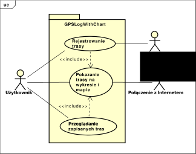
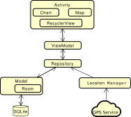
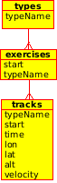
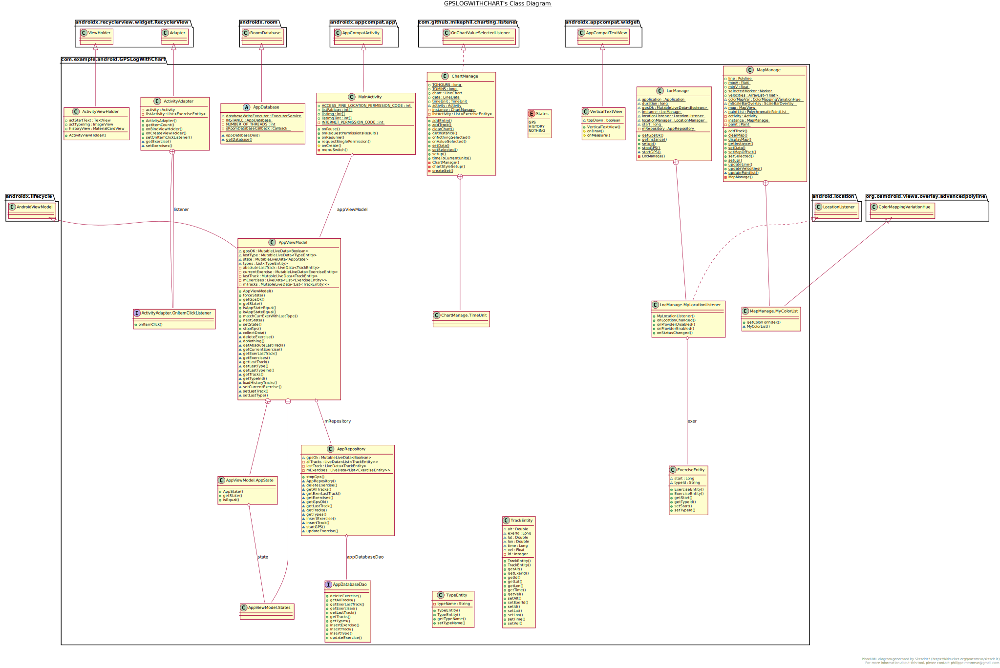
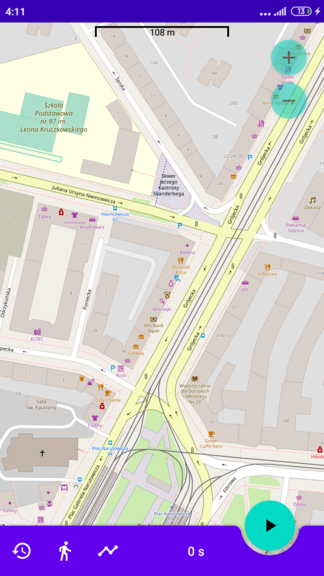
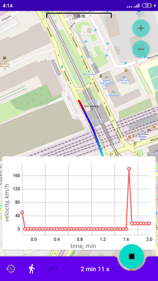
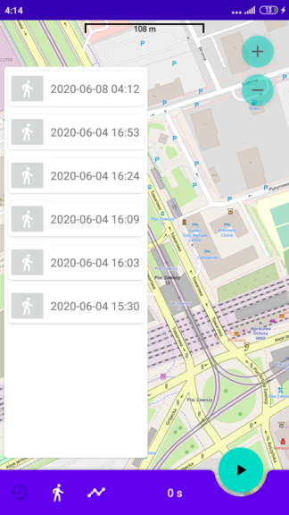
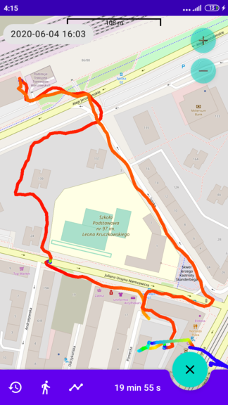

# GPSLogWithChart

Projekt zaliczeniowy z przedmiotu *Projekt programistyczny indywidualny* 2019/2020 na WMP.SNŚ UKSW. 

*GPSLogWithChart* jest to aplikacja na system Android do odczytywania prędkości i pozycji z GPS-a i pokazaniu ich mapie i wykresie.

Autor: Anna Kelm
# Ogólny opis działania
Aplikacja pozwala na rejestrowanie pokonanej przez użytkownika trasy w formie kolejnych punktów zawierających dokładny czas, lokalizację i prędkość. 
Danych dostarcza lokalizacja GPS telefonu. Przebyta trasa wyświelana jest na mapie w postaci
 linii, której odcinki oznaczone są kolorami zgodnie z odpowiadającymi im prędkościami. Wglądu w
  wartości liczbowe prędkości dostarcza wykres w funkcji czasu. Po zaznaczeniu punktu na wykresie, znacznik na mapie pokazuje jego pozycję - i *vice versa*. Wszystkie zapisane trasy można r
  ównież wczytać i usunąć.  

# Opis funkcjonalności

Aplkacja realizuje funkcjonalności zgodnie z poniższymi przypadkami użycia wraz ze scenariuszami.

|  			  Nazwa		          | Wartość 			  		                                                                                                                                                                                                                                                                                                                                                                                                                                                        |
|---------------------------|--------------------------------------------------------------------------------------------------------------------------------------------------------------------------------------------------------------------------------------------------------------------------------------------------------------------------------------------------------------------------------------------------------------------------------------------------------------|
|  			 Identyfikator 		          |  			 uc 		                                                                                                                                                                                                                                                                                                                                                                                                                                                        |
|  			 Nazwa 		                  |  			 Rejestrowanie 			trasy 		                                                                                                                                                                                                                                                                                                                                                                                                                                       |
|  			 Aktorzy 		                |  			 Użytkownik, 			Usługa GPS 		                                                                                                                                                                                                                                                                                                                                                                                                                                     |
|  			 Scenariusz główny 		      |  			 1. 			Użytkownik wybiera typ aktywności.  	 		 2. 			Użytkownik sygnalizuje chęć rejestrowania trasy.  		 	 3. 			Usługa GPS otrzymuje 			prośbę o dostarczanie danych lokalizacyjnych.  		 	 4. 			System zapisuje dane dostarczone przez Usługa GPS.  		 	 5. 			System Pokazuje trasę na wykresie i mapie.  		 	 6. 			Użytkownik sygnalizuje chęć zakończenia rejestrowania trasy.  		 	 7. 			Usługa 			GPS otrzymuje 			informację o braku zapotrzebowania na dane.  	 		 8. 			System przestaje rejestrować trasę. 		 |
|  			 Wyjątki i rozszerzenia 		 |  			 3A. 			Aplikacja nie ma uprawnień do danych z Usługi GPS.  		 	 3A.1. 			Przejdź 			do 9. 		                                                                                                                                                                                                                                                                                                                                                                              |

|  			 Nazwa 		                  |  			 Wartość 		                                                                                                                                                                                            |
|---------------------------|-------------------------------------------------------------------------------------------------------------------------------------------------------------------------------------------------------|
|  			 Identyfikator 		          |  			 uc 		                                                                                                                                                                                                 |
|  			 Nazwa 		                  |  			 Przeglądanie 			zapisanych tras 		                                                                                                                                                                       |
|  			 Aktorzy 		                |  			 Użytkownik 		                                                                                                                                                                                         |
|  			 Scenariusz główny 		      |  			 1. 			Użytkownik sygnalizuje 			chęć zobaczenia listy poprzednich tras.  		 	 2. 			System pokazuję listę poprzednich tras.  	 		 3. 			Użytkownik wybiera trasę do wyświetlenia.  		 	 4. 			System pokazuje trasę na mapie. 		 |
|  			 Wyjątki i rozszerzenia 		 |  			 3A. 			Użytkownik wybiera trasę do usunięcia.  	 		 3A.1. 			System usuwa trasę. 		                                                                                                                             |

|  			 Nazwa 		                  |  			 Wartość 		                                                                                                                                                                                                                                                               |
|---------------------------|--------------------------------------------------------------------------------------------------------------------------------------------------------------------------------------------------------------------------------------------------------------------------|
|  			 Identyfikator 		          |  			 uc 		                                                                                                                                                                                                                                                                    |
|  			 Nazwa 		                  |  			 Pokazanie 			trasy na wykresie i mapie 		                                                                                                                                                                                                                                   |
|  			 Aktorzy 		                |  			 Użytkownik, 			Połączenie z Internetem 		                                                                                                                                                                                                                                   |
|  			 Scenariusz główny 		      |  			 1. 			Użytkownik wybiera trasę do pokazania.  		 	 2. 			System pobiera poprzez Połączenie z Internetem potrzebny 			fragment mapy.   			 3. 			System pokazuje ślad 			trasy 			na mapie.  		 	 4. 			Użytkownik sygnalizuje chęć zobaczenia wykresu prędkości od 			czasu.  		 	 5. 			System pokazuje wykres. 		 |
|  			 Wyjątki i rozszerzenia 		 |  			 2A. 			Nie jest dostępne Połączenie z Internetem.  	 		 2A.1. 			Fragment mapy nie jest pobierany.  			   			    			 3A. 			Fragment mapy nie został pobrany.  		 	 3A.1. 			Ślad 			trasy jest wyświetlany na tle zastępczym. 		                                                                          |

# Wymagania systemowe/sprzętowe
* Android z API >= 25 (Nugat 7.1),
* połączenie z Internetem, potrzebne do pobrania mapy,
* GPS.

# Uprawnienia wymagane do uzyskania pełnej funkcjonalności aplikacji
* połączenie z Internetem,
* dokładna lokalizacja.

# Architektura aplikacji

Aplikacja została napisana w języku Java wersja 1.8 w środowisku Android Studio. Została ona
  stworzona według wzorca architektonicznego *model-view-viewmodel* (MVVM). W wzorcu tym
  warstwa interfesju użytkownika (UI) jest oddzielona strukturalnie od warstwy danych. Pośrednikiem pomiędzy obiema 
  warstwami jest *viewmodel*. Zgodnie z powyższym, niniejszą aplikację można podzielić na następujące
  logiczne podzespoły:
  
  
  
  * *Activity* - obiekt tej klasy tworzy i uruchamia interfejs użytkownika. Wewnątrz interfejsu tej aplikacji znajdują się jeszcze:
   - *RecyclerView* - wyświetla zarchiwizowane trasy w formie listy, wykorzystując wzorzec *Pool of objects*,
   - *Map* - mapa, wykorzystując bibliotekę [OSMDroid](https://github.com/osmdroid/osmdroid), będącą interfesjem do OpenStreetMap,
   - *Chart* - wykres, wykorzystująć bibliotekę [MPAndroidChart](https://github.com/PhilJay/MPAndroidChart),
  * *ViewModel* - przechowuje i dostarcza interfejsowi potrzebne dane,
  * *Repository* - repozytorium zarządza źródłami danych: pobieraniem i zapisywaniem informacji,
  * *Model* - opisuje dane przechowywane przez aplikację. Dane zbierane z usługi GPS zapisywane są w bazie danych SQLite, która zarządzana 
  jest poprzez biliotekę Room. Po zapisaniu danych w bazie następuje synchronizacja *ViewModel* oraz *View* z bazą.
  * *Location Manager* - klasa dostarczająca informacje o lokalizacji, dla tej aplikacji obsługująca komunikację z modułem GPS w modemie. 
  Zebrane dane poprzez repozytorium zapisywane są w bazie danych.  

# Dane wprowadzane i przechowywane w systemie
## Mapa
Kafelki* służące do wyświetlenia bieżącego obszaru mapy, są pobierane na bieżąco z Internetu i usuwane po wyjściu z aplikacji. W planie jest opcja ustawienia *cache*-u.
## Dane lokalizacyjne
Dane lokalizacyjne dostarczane są w formie obiektów z klasy *Location* (pakiet *android.location*). Wyłuskiwane z tych obiektów dane to: 
współrzędne geograficzne (długość, szerokość, wysokość), czas, prędkość. Dane te zapisywane są w bazie danych.
## Baza danych
Baza przechowuje dane lokalizacyjne oraz ustawienia zbieranej trasy (chwilowo jest to tylko typ aktywności). Baza danych jest obiektem lokalnym,
 zostaje ona w systemie po deintstalacji aplikacji. W planach jest możliwość eksportu bazy i profile użytkowników.
 Schemat bazy reprezentuje poniższy diagram.

 

# Diagram klas
Poniżej znajduje się diagram klas dla aplikacji razem z polami i metodami. Diagram w pełnej rozdzielczości
można znaleźć [tutaj](readme_img/class_diagram.svg).

# Interfejs użytkownika
Głównym elementem interfejsu jest mapa. Przyciski na pasku dolnym umożliwiają, odpowiednio, 
wyświetlenie listych zapisanych tras, wejście w ustawienia trasy i podgląd wykresu. Przycisk w lewym 
dolnym rogu służy do włączania/wyłączania akwizycji danych z GPS.
## Główny ekran

## Rejestrowanie trasy

## Lista zapisanych tras

## Wyświetlanie zapisanej trasy

# Testy
Zostały zrobione jedynie testy funkcjonalne.

<!---
# Licencja
2020 Anna Kelm

Niniejszy program jest wolnym oprogramowaniem; możesz go
rozprowadzać dalej i/lub modyfikować na warunkach Powszechnej
Licencji Publicznej GNU, wydanej przez Fundację Wolnego
Oprogramowania - według wersji 3 tej Licencji lub (według twojego
wyboru) którejś z późniejszych wersji.

Niniejszy program rozpowszechniany jest z nadzieją, iż będzie on
użyteczny - jednak BEZ JAKIEJKOLWIEK GWARANCJI, nawet domyślnej
gwarancji PRZYDATNOŚCI HANDLOWEJ albo PRZYDATNOŚCI DO OKREŚLONYCH
ZASTOSOWAŃ. W celu uzyskania bliższych informacji sięgnij do     Powszechnej Licencji Publicznej GNU.

Z pewnością wraz z niniejszym programem otrzymałeś też egzemplarz
Powszechnej Licencji Publicznej GNU (GNU General Public License);
jeśli nie - zobacz <http://www.gnu.org/licenses/>.
--->